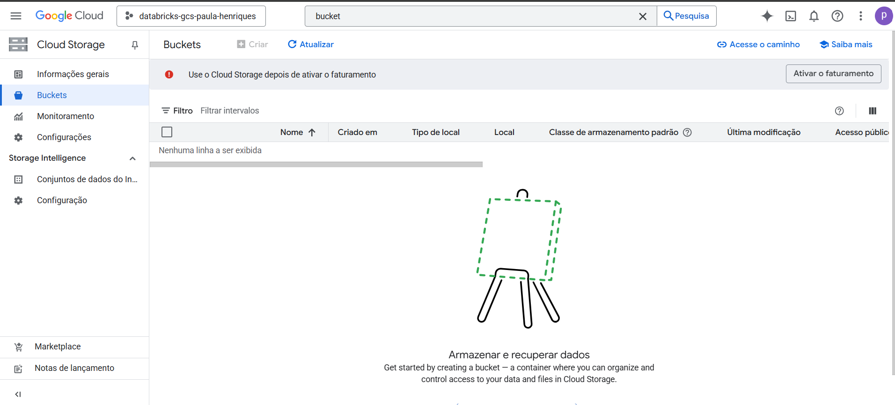
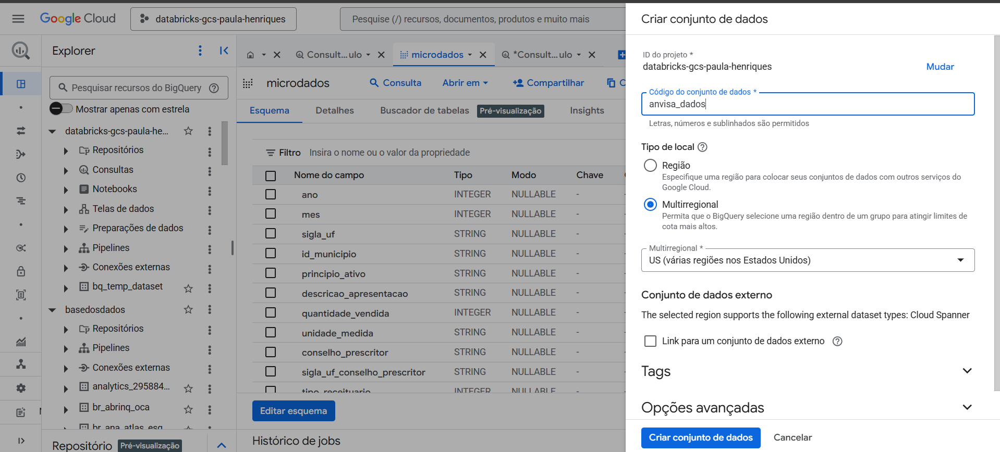
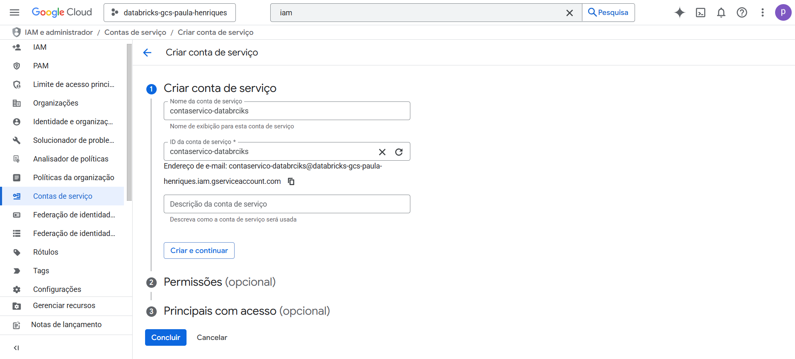
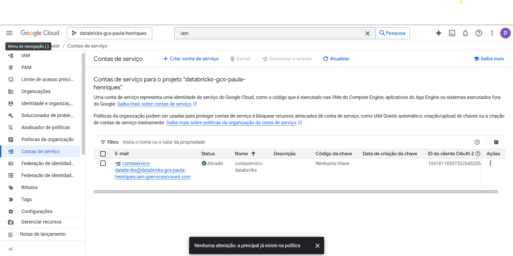
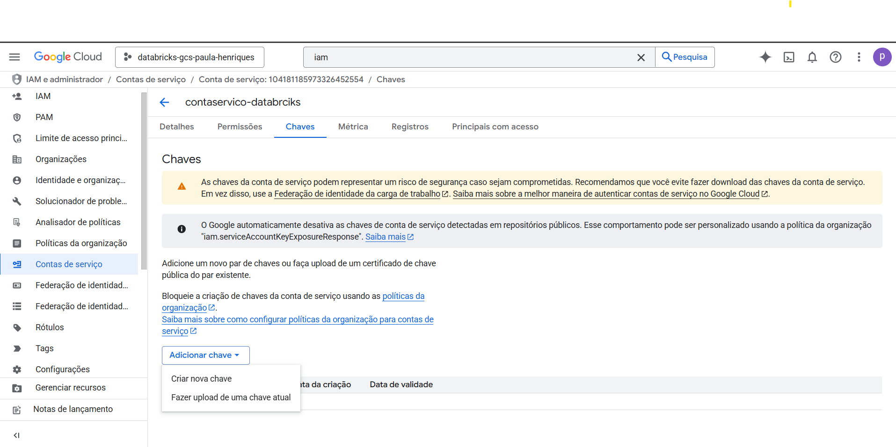
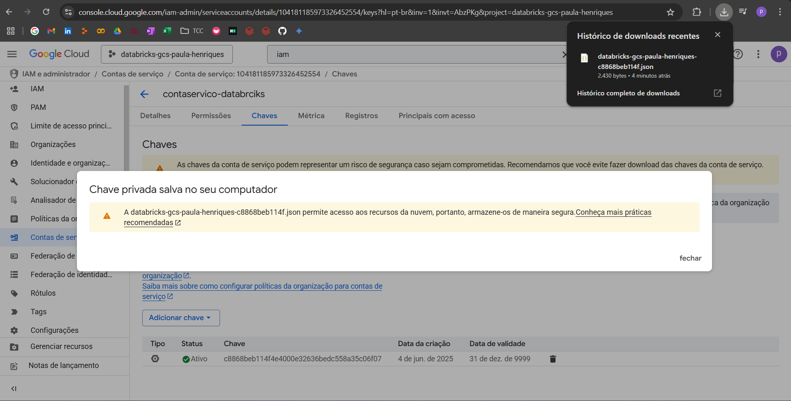

# Federation Databricks + Google Cloud Storage usando bucket e chave JSON

## Resumo
Tive recentemente o desafio de consumir dados do BigQuery no Databricks, e no processo, precisei entender como integrar os dois serviços de forma segura e eficiente.  
A solução envolveu o uso de um bucket no Google Cloud Storage (GCS) e autenticação via chave de conta de serviço (JSON). Para não esquecer e também ajudar outras pessoas que passem por isso, resolvi documentar tudo neste repositório.  
Espero que esse tutorial te ajude também!

## 1 - Criando um bucket
1.1 - Acesse o Google Cloud Storage, por meio do link (https://console.cloud.google.com/?hl=pt-br)   
1.2 - Na barra de pesquisa procure por bucket, como mostro na imagem   
1.3 - Selecione o bucket, e ira abrir a tela a baixo, note que, a opção "+ criar" esta desativada, vamos precisar por uma forma de pagamento   
1.4 - Após inserir a forma de faturamento, a opção "+ criar" fica ativada, como mostro na imagem.   
1.5 - Selecione "+ criar" e irá aparecer abaixo, selecione um nome que deseja e clique em "Continuar"   
1.6 - Irá direcionar para as opções de armazenamentos dos dados eu mantive o defult, como na imagem   
1.7 - Podemos manter o default em todas as opções seguintes, ficando com uma tela parecida com essa aqui   
ao rolar a tela mais para baixo teremos o botão de "Criar"   
1.8 - Após a criação será direcionado para a tela de buckets, e nela você pode fazer o upload de um arquivo, como mostro na imagem a baixo, como não é o nosso caso que queremos pegar os dados do BigQuery, iremos seguir de outra forma.   

## 2 - Puxando a base do BigQuery
2.1 - Vá para a base do seu BigQuery, a que estou usando aqui se encotra no seguinte link (https://basedosdados.org/dataset/bd52ab08-9980-4831-a88c-a1ac5226ef27?table=26d8e34b-731c-4852-a838-f3f6409a07f6), e selecione os 3 pontinhos, selecione "Query", como mostro a baixo   
2.2 - Faça um select para ter uma noção de como é a base    
2.3 - Vá no seu projeto e selecione os 3 pontinhos, selecione "Criar conjunto de dados"   
2.4 - Ele vai abrir a aba lateral e você escolher o nome do seu conjunto, e selecione "Criar conjunto de dados"  
2.5 - Após criando, vamos voltar na query inicial que fizemos e criar a nossa tabela copiando os dados da origem, algo assim [copiar_tabela_microdados.sql](copiar_tabela_microdados.sql) como mostro na imagem  
2.6 - No canto direito na linha do seu perfil, ao lado so sino temos um quadrado, cliquei nele para que abrissse nosso pronpt de comando e coloquei algo como  
bq extract \
  --destination_format=CSV \
  --field_delimiter="," \
  --print_header=true \
  'databricks-gcs-paula-henriques:anvisa_dados.microdados' \
  'gs://bucket_databrciks_gcs/microdados_anvisa/microdados  
para passar os dados da tabela para o nosso buket, após rodar, ele deve ficar assim  
2.7 - Agora podemos conferir no nosso buket, so repetir o processo inical de na barrra de pesquisa procurar por "buket" e selecionar, deve aparecer assim  

## 3 - Criando a conta de serviço    
3.1 - Na barrra de pesquisa procurar por "IAM" e selecionar da   
3.2 - Ao selecionar IAM a tela ficara parecido com isso   
3.3 - Na barra lateral, selecione "Contas de serviço"   
3.4 - Selecione "Criar conta de serviço" e  escolha um nome para a sua conta, apos isso selecione "Criar e continuar"   
3.5 - Em permissões vá em "Em uso" e selecione "proprietario"  
3.6 - Clique em "Continuar"  
3.7 - Em principais com acesso, pode deixar o default, e selecione "Concluir"  

## 4 - Criando a chave de serviço   
4.1 - Você sera redirecionado para a tela com as contas, selecione a conta que acabou de criar.  
4.2 - Aqui podemos ver os detalhes da conta, selecione "chaves" 
4.3 - Selecione "Adicionar chave" e selecione "Criar nova chave" 
4.4 - Ira abria a seguinte tela, deixe marcado como JSON 
4.5 - Ele automativamente fara o dowload dela no seu coputador 
