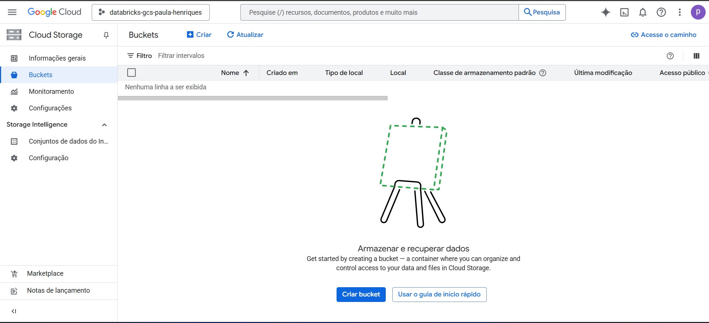
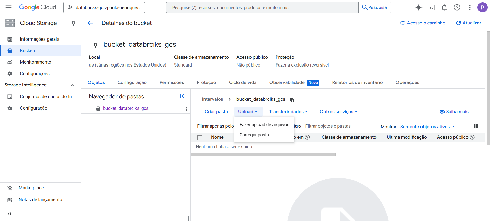

# Federation Databricks + Google Cloud Storage usando bucket e chave JSON

## Resumo
Tive recentemente o desafio de consumir dados do BigQuery no Databricks, e no processo, precisei entender como integrar os dois serviços de forma segura e eficiente.  
A solução envolveu o uso de um bucket no Google Cloud Storage (GCS) e autenticação via chave de conta de serviço (JSON). Para não esquecer e também ajudar outras pessoas que passem por isso, resolvi documentar tudo neste repositório.  
Espero que esse tutorial te ajude também!

## 1 - Criando um bucket
1.1 - Acesse o Google Cloud Storage, por meio do link (https://console.cloud.google.com/?hl=pt-br)   
1.2 - Na barra de pesquisa procure por bucket, como mostro na imagem   
1.3 - Selecione o bucket, e ira abrir a tela a baixo, note que, a opção "+ criar" esta desativada, vamos precisar por uma forma de pagamento (mas fique tranquilo que no final mostro como desativar)   
1.4 - Após inserir a forma de faturamento, a opção "+ criar" fica ativada, como mostro na imagem.   
1.5 - Selecione "+ criar" e irá aparecer abaixo, selecione um nome que deseja e clique em "Continuar"   
1.6 - Irá direcionar para as opções de armazenamentos dos dados eu mantive o defult, como na imagem   
1.7 - Podemos manter o default em todas as opções seguintes, ficando com uma tela parecida com essa aqui   
ao rolar a tela mais para baixo teremos o botão de "Criar"   
1.8 - Após a criação será direcionado para a tela de buckets, e nela você pode fazer o upload de um arquivo, como mostro na imagem a baixo, como não é o nosso caso que queremos pegar os dados do BigQuery, iremos seguir de outra forma.   

## 2 - Puxando a base do BigQuery
2.1 - Vá para a base do seu BigQuery, a que estou usando aqui se encotra no seguinte link (https://basedosdados.org/dataset/bd52ab08-9980-4831-a88c-a1ac5226ef27?table=26d8e34b-731c-4852-a838-f3f6409a07f6), e selecione os "3" pontinhos, selecione "Query", como mostro a baixo   
2.2 - Faça um select para ter uma noção de como é a base    
2.3 - 
