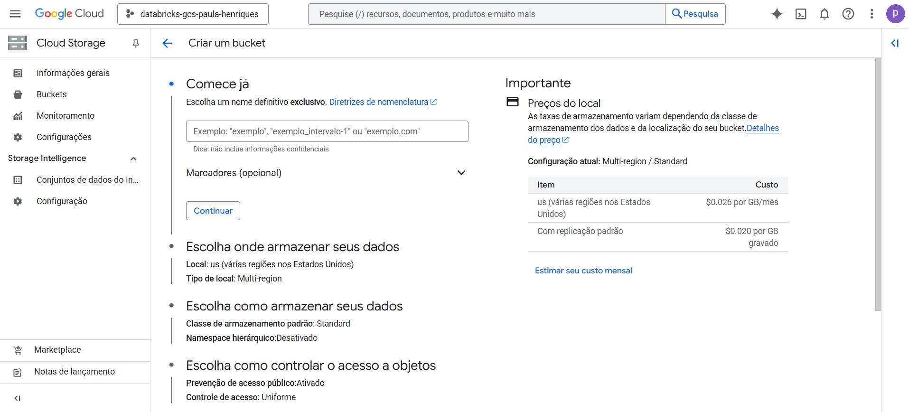

## 1 - Criando um bucket

1.1 - Acesse o [Google Cloud Console](https://console.cloud.google.com/?hl=pt-br)  

  
  

1.2 - Na barra de pesquisa, procure por "bucket", como mostro na imagem:  

  
  

1.3 - Ao abrir a tela de buckets, repare que a opção "+ Criar" pode estar desativada. Será necessário adicionar uma forma de pagamento:  

  
  

1.4 - Após inserir os dados de faturamento, a opção "+ Criar" ficará ativada:  

  
  

1.5 - Clique em "+ Criar", escolha um nome para o bucket e clique em "Continuar":  

  
  

1.6 - Nas opções de armazenamento, mantive as configurações padrão (default):  

  
  

1.7 - Siga com os padrões nas etapas seguintes. No final, clique em "Criar":  

  
  

1.8 - Com o bucket criado, você verá a tela com a opção de upload. Como neste caso vamos puxar dados do BigQuery, seguimos para o próximo passo:  

  
  
