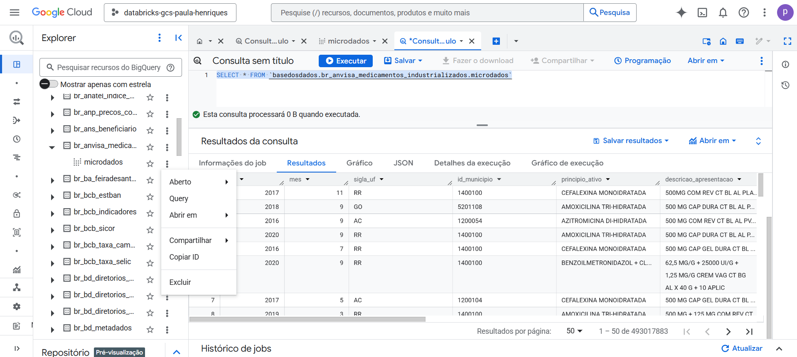
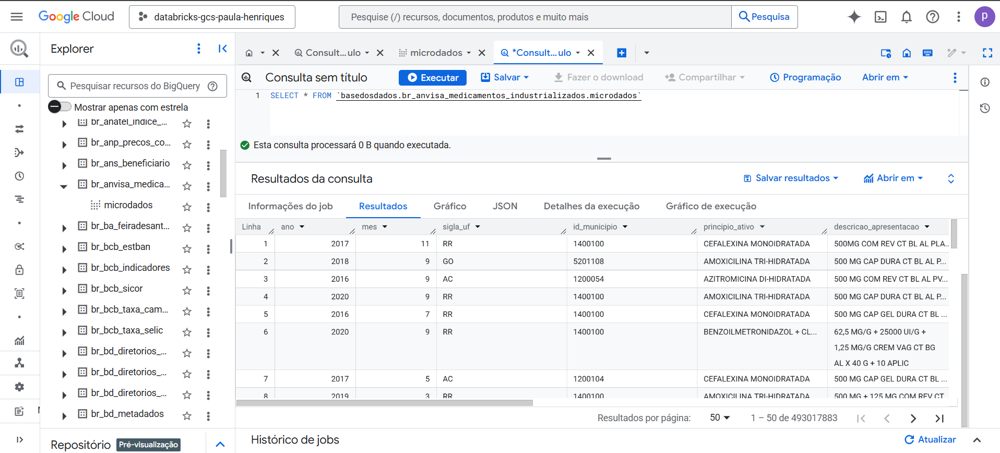
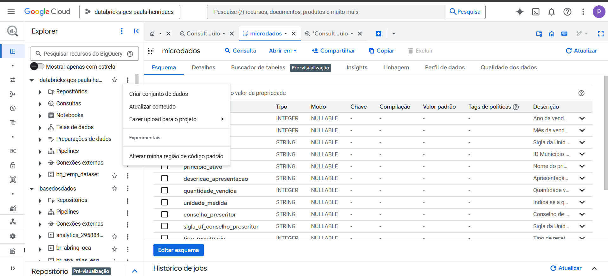
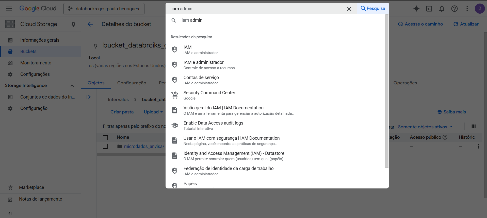
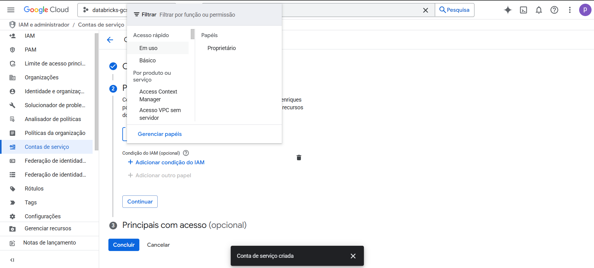
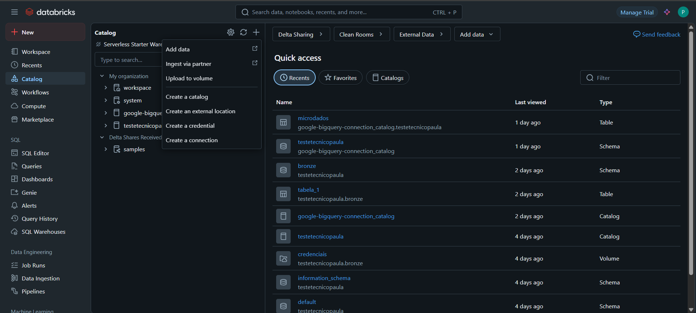
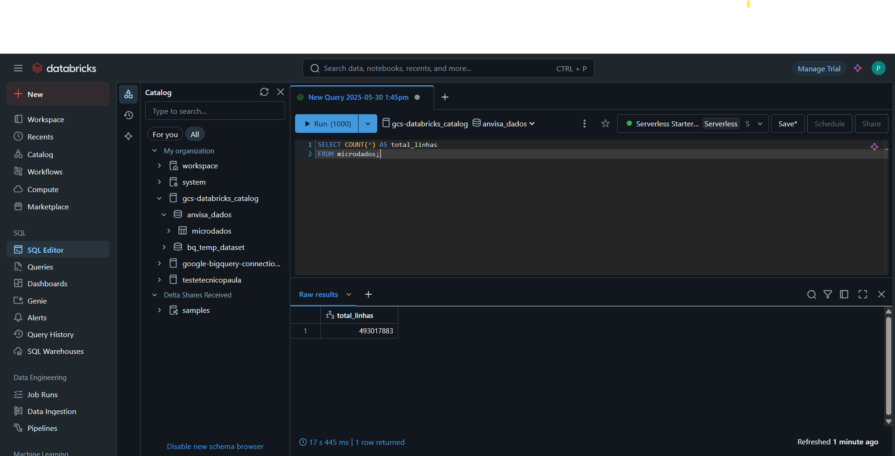

# Federation Databricks + Google Cloud Storage using Bucket and JSON Key

## Summary

I recently needed to integrate BigQuery with Databricks to securely and efficiently consume a dataset.  
After some testing, I chose to use a bucket in Google Cloud Storage (GCS) with authentication via a service account JSON key.  
I documented the entire process here both as a personal reference and to help others going through something similar.

---

## 1 - Creating a bucket

1.1 - Go to the [Google Cloud Console](https://console.cloud.google.com/?hl=pt-br)  
1.2 - In the search bar, search for "bucket", as shown in the image:  
  
1.3 - When the bucket screen opens, note that the "+ Criar" option may be disabled. You will need to add a payment method:  
  
1.4 - After entering the billing information, the "+ Criar" option will be enabled:  
  
1.5 - Click "+ Criar", choose a name for your bucket, and click "Continuar":  
  
1.6 - In the storage options, keep the default settings:  
  
1.7 - Proceed with the default settings in the next steps. At the end, click "Criar":  
  
  
1.8 - Once the bucket is created, you will see the upload screen. Since in this case we will pull data from BigQuery, proceed to the next step:  


---

## 2 - Exporting the BigQuery Database

2.1 - Access the BigQuery database. The one used in this example is at this link: [Base dos Dados – Medicamentos Industrializados](https://basedosdados.org/dataset/bd52ab08-9980-4831-a88c-a1ac5226ef27?table=26d8e34b-731c-4852-a838-f3f6409a07f6)  
Click the three dots and select **"Query"**:

2.2 - Perform a simple SELECT to understand the table structure:

2.3 - In your project, click the three dots and select **"Create dataset"**:

2.4 - Choose a name and click **"Create dataset"**:

2.5 - Go back to the query and create a new table by copying the original data. Example:
[**copiar_tabela_microdados.sql**](copy_microdata_table.sql)

2.6 - In the upper right corner of the interface, click the terminal icon (Cloud Shell). Use the following command to extract the table to your bucket:

```bash
bq extract \
  --destination_format=CSV \
  --field_delimiter="," \
  --print_header=true \
  'databricks-gcs-paula-henriques:anvisa_dados.microdados' \
  'gs://bucket_databrciks_gcs/microdados_anvisa/microdados_*.csv'
```

After execution, the files should appear as shown in the image:
2.7 - To confirm, access the bucket again via the console:


---

## 3 - Creating the Service Account

3.1 - Search for "IAM" in the console and select the option:

3.2 - The IAM screen will look similar to this:

3.3 - In the side menu, select **"Service accounts"**:

3.4 - Click **"Create service account"**, choose a name, and proceed:

3.5 - For permissions, go to **"In use"** and select **"Owner"**:

3.6 - Click **"Continue"**:

3.7 - Keep the default for **"Grant users access"** and conclude:


---

## 4 - Generating the Authentication Key

4.1 - With the account created, click on it:

4.2 - Go to the **"Keys"** tab:

4.3 - Click **"Add Key"** and select **"Create new key"**:

4.4 - Choose the **JSON** format:

4.5 - The download will automatically start to your computer:

4.6 - Open the .json file and copy its entire content. We will paste it into Databricks:


---
## 5 - Connecting to Databricks

> ⚠️ Important: you need permissions to create clusters and connections in Databricks.

5.1 - Access Databricks, go to **SQL Warehouse**, choose the desired cluster, and turn it on:

5.2 - Go to **Catalog**, click **“+”** and select **“Create a connection”**:

5.3 - Choose **“Google BigQuery”** as the connection type and click **“Next”**:

5.4 - In the key field, paste the content of the JSON generated in step 4.6.
The project_id is also within the JSON. After filling it in, click **“Create a connection”**:

5.5 - Give your catalog a name, re-enter the project_id, and click **“Test connection”**:

5.6 - You will be prompted to select the cluster. Remember: it must be running. Then, click **“Test”**:

5.7 - If the connection is successful, you'll see a screen like this:

5.8 - In the following steps (**“Access”** and **“Keys”**), just proceed by clicking **“Next”**:


Done! Connection successfully established. 😉

---
## 6 - Validation

6.1 - Access the **Catalog** in Databricks to verify that the connection was created correctly:

6.2 - Since the goal was to ensure the complete data load, I performed a COUNT(*) in both Databricks and BigQuery to compare the totals:



---

## Final Observations

I hope this content has helped you better understand the integration process between BigQuery and Databricks via Google Cloud Storage.
My aim here was to document the key steps I encountered in a practical way, serving as both a future reference and support for anyone facing similar challenges.

If you have suggestions, questions, or want to share your experiences on this topic, feel free to reach out.
