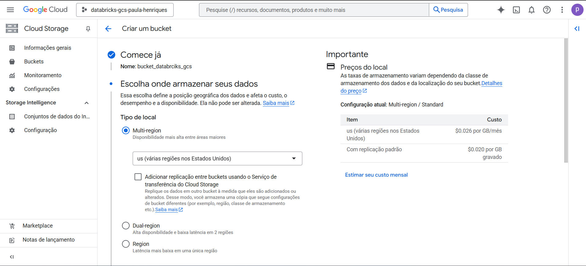
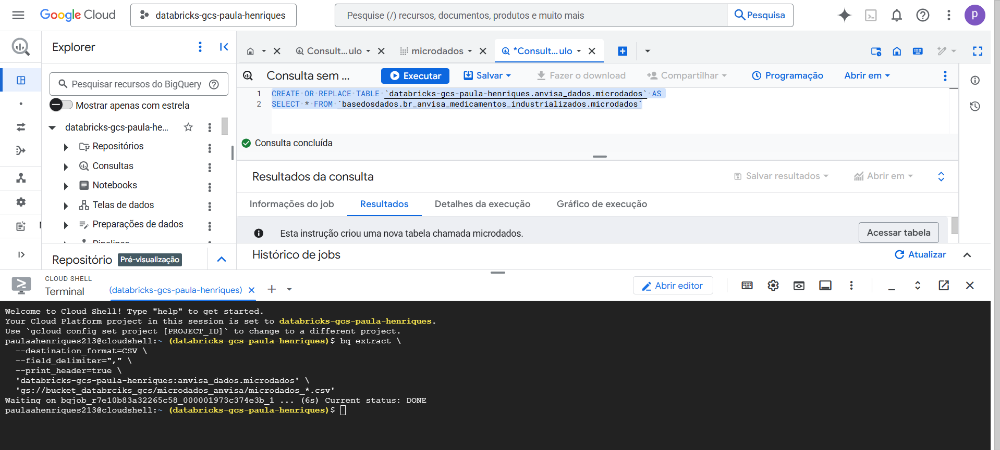
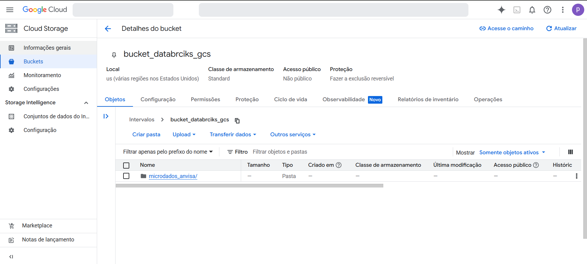
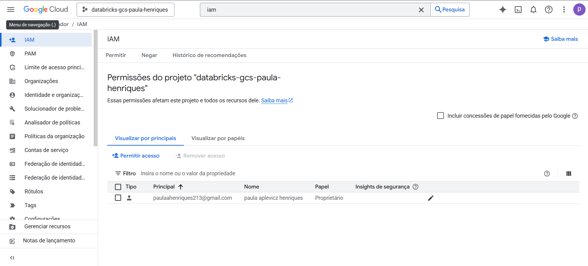
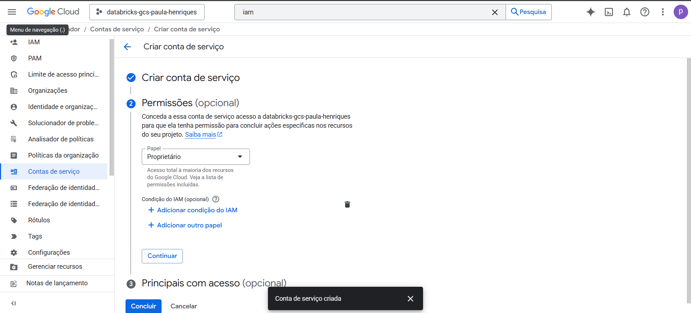
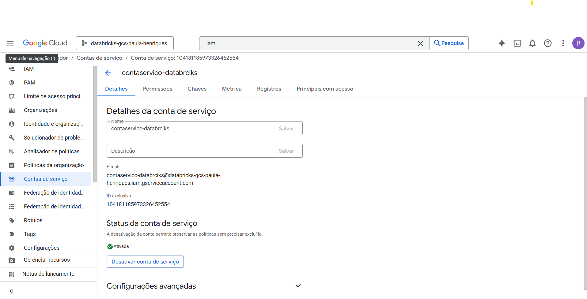
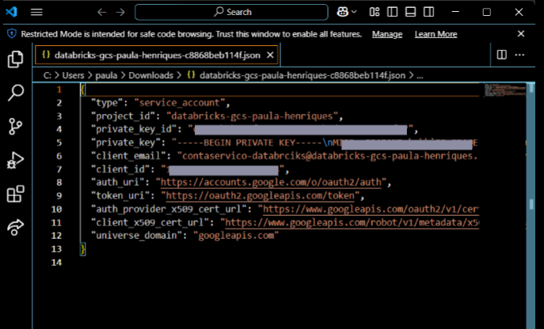
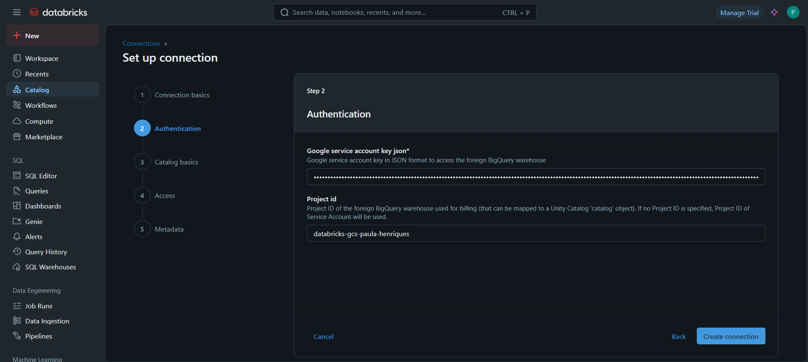
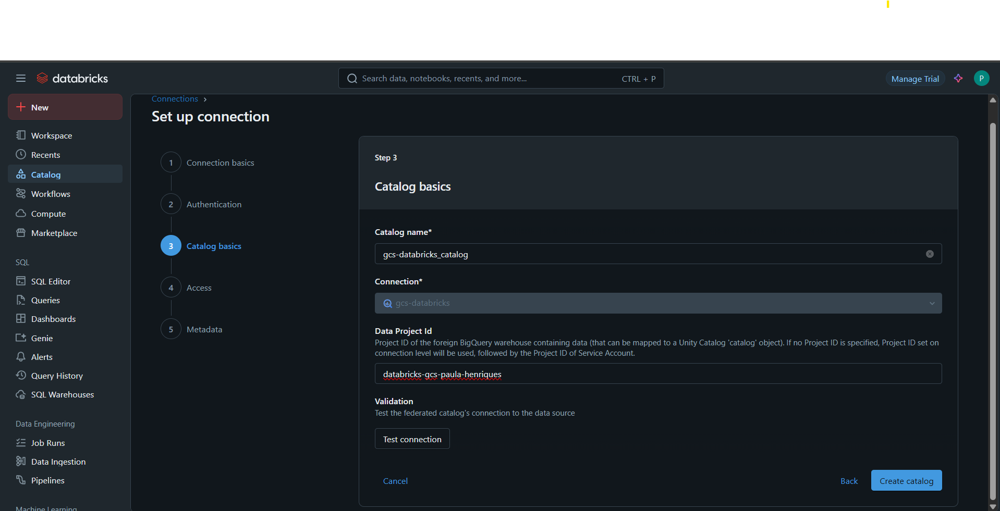
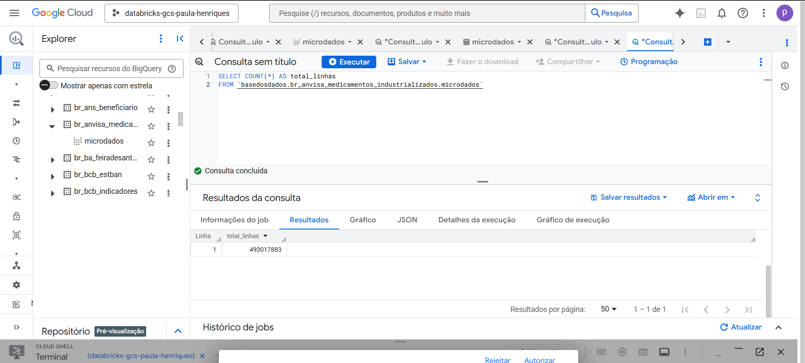

# Federation Databricks + Google Cloud Storage using Bucket and JSON Key

**This tutorial is available in two languages:**  
🇧🇷 [Portuguese tutorial](tutorial.pt.md)  
🇺🇸 [English tutorial](tutorial.en.md)

---

## Summary

Recently, I had to integrate BigQuery with Databricks to securely and efficiently consume a dataset.  
After some testing, I decided to use a Google Cloud Storage (GCS) bucket with authentication via a service account key (JSON).  
I documented the entire process here, both as a personal reference and to support others who may be going through something similar.

---

## 1 - Creating a bucket

1.1 - Go to the [Google Cloud Console](https://console.cloud.google.com/?hl=pt-br)  

  
  


1.2 - In the search bar, look for "bucket", as shown in the image:  

  
  


1.3 - When the bucket screen opens, note that the "+ Criar" button might be disabled. You’ll need to add a billing method first:  

  
  


1.4 - After adding billing info, the "+ Criar" button becomes active:  

  
  


1.5 - Click "+ Criar", choose a name for your bucket, and click "Continuar":  

  
  


1.6 - On the storage options screen, I kept the default settings:  

  
  


1.7 - Continue with the defaults on the next steps. At the end, click "Criar":  

  
  


1.8 - Once the bucket is created, you'll see the upload screen. Since our goal is to pull data from BigQuery, we'll move on to the next step:  

  
  


---

## 2 - Exporting the BigQuery dataset

2.1 - Go to your BigQuery dataset. The one used in this example is here:  
[Base dos Dados – Medicamentos Industrializados](https://basedosdados.org/dataset/bd52ab08-9980-4831-a88c-a1ac5226ef27?table=26d8e34b-731c-4852-a838-f3f6409a07f6)  
Click the three dots and select "Fazer consulta (Query)":  

  
  


2.2 - Run a simple `SELECT` to preview the table structure:  

  
  


2.3 - In your project, click the three dots and select "Criar conjunto de dados":  

  
  


2.4 - Choose a name and click "Criar conjunto de dados":  

  
  


2.5 - Return to the query tab and create a new table by copying the data from the original one. Example:  
[**copy_microdata_table.sql**](copy_microdata_table.sql)  

  
  


2.6 - In the top-right corner, click the terminal icon (Cloud Shell) and run the following command to extract the table to your bucket:

```bash
bq extract \
  --destination_format=CSV \
  --field_delimiter="," \
  --print_header=true \
  'databricks-gcs-paula-henriques:anvisa_dados.microdados' \
  'gs://bucket_databrciks_gcs/microdados_anvisa/microdados_*.csv'
```

After running it, the files should appear like this:  

  
  


2.7 - To confirm, go back to your bucket through the console:  

  
  


---

## 3 - Creating the service account

3.1 - In the search bar, look for "IAM" and select the option:  

  
  


3.2 - The IAM screen should look like this:  

  
  


3.3 - On the side menu, select "Contas de serviço":  

  
  


3.4 - Click "Criar conta de serviço", choose a name and proceed:  

  
  


3.5 - In permissions, go to "Em uso" and select "Proprietário":  

  
  


3.6 - Click "Continuar":  

  
  


3.7 - Leave "Principais com acesso" with the default and finish the process:  

  
  


---

## 4 - Generating the authentication key

4.1 - After creating the account, click on it:  

  
  


4.2 - Go to the "Chaves" tab:  

  
  


4.3 - Click "Adicionar chave" and select "Criar nova chave":  

  
  


4.4 - Choose the **JSON** format:  

  
  


4.5 - The file will be automatically downloaded to your computer:  

  
  


4.6 - Open the `.json` file and copy the entire content. We'll paste it in Databricks later:  

  
  


---

## 5 - Connecting to Databricks

> ⚠️ Important: You need permission to create clusters and connections in Databricks.

5.1 - In Databricks, go to **SQL Warehouse**, select your desired cluster and start it:  

  
  


5.2 - Go to **Catalog**, click “+” and select “Create a connection”:  

  
  


5.3 - Choose “Google BigQuery” as the connection type and click “Next”:  

  
  


5.4 - In the key field, paste the JSON content copied in step 4.6.  
The `project_id` is also in the JSON. After filling both, click “Create a connection”:  

  
  


5.5 - Name your catalog, insert the `project_id` again, and click “Test connection”:  

  
  


5.6 - You’ll be prompted to select the cluster (remember, it needs to be running). Click “Test”:  

  
  


5.7 - If the connection is successful, you’ll see a screen like this:  

  
  


5.8 - In the following steps (“Access” and “Keys”), simply proceed by clicking “Next”:  

  
  
  


Done! Connection successfully created. ✅

---

## 6 - Validation

6.1 - Go to the **Catalog** section in Databricks to confirm that the connection was created correctly:  

  
  


6.2 - Since the goal was to load the full dataset, I ran a `COUNT(*)` in both Databricks and BigQuery to compare row totals:  

  
  
  


---

## Final notes

I hope this guide helped you understand the integration process between BigQuery and Databricks using Google Cloud Storage.  
The idea was to document the main steps I went through — both for my future self and for anyone else facing a similar task.

If you have suggestions, questions, or want to share your experience, feel free to reach out!

