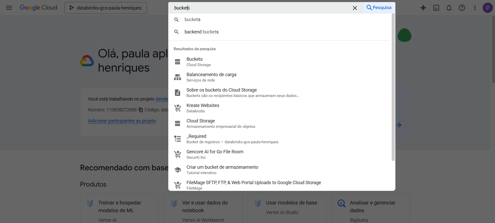
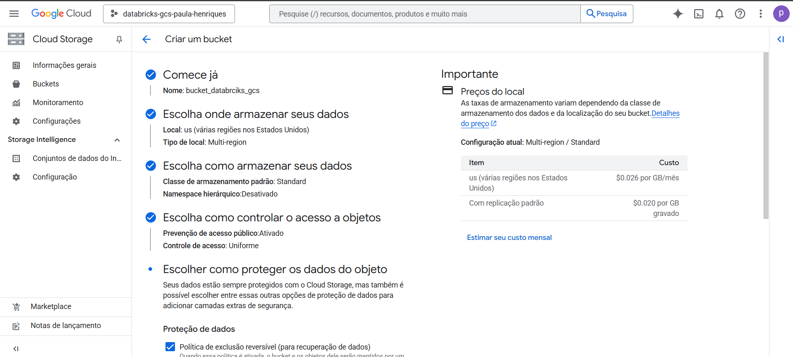
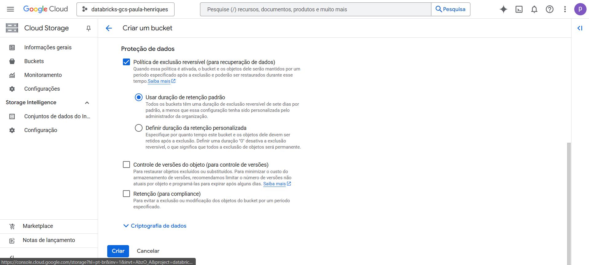
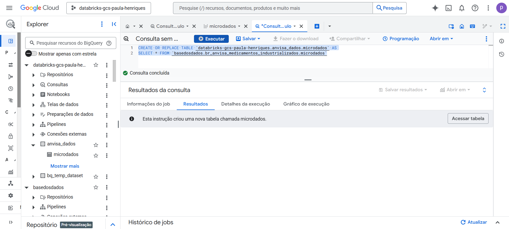
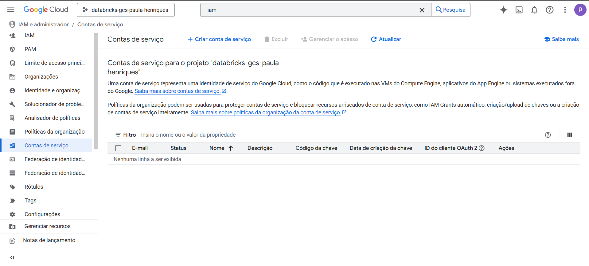
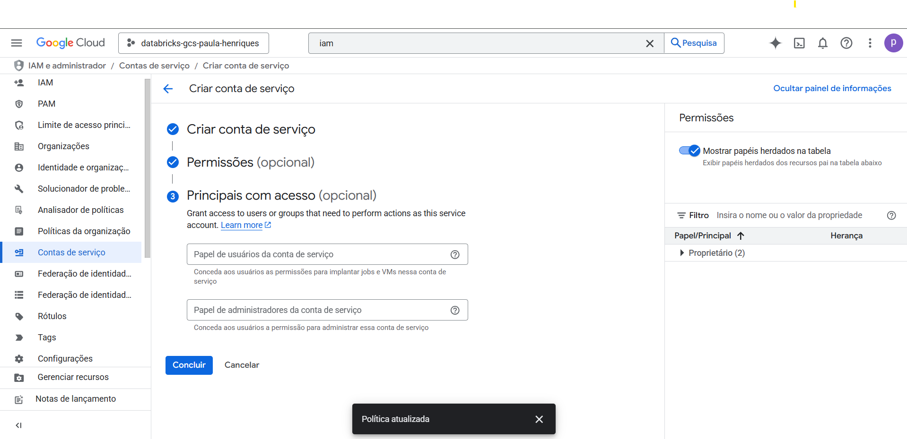
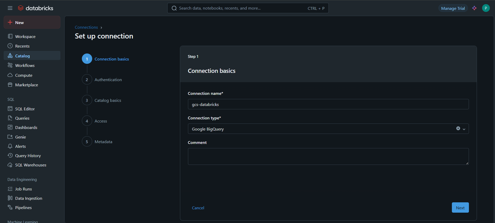
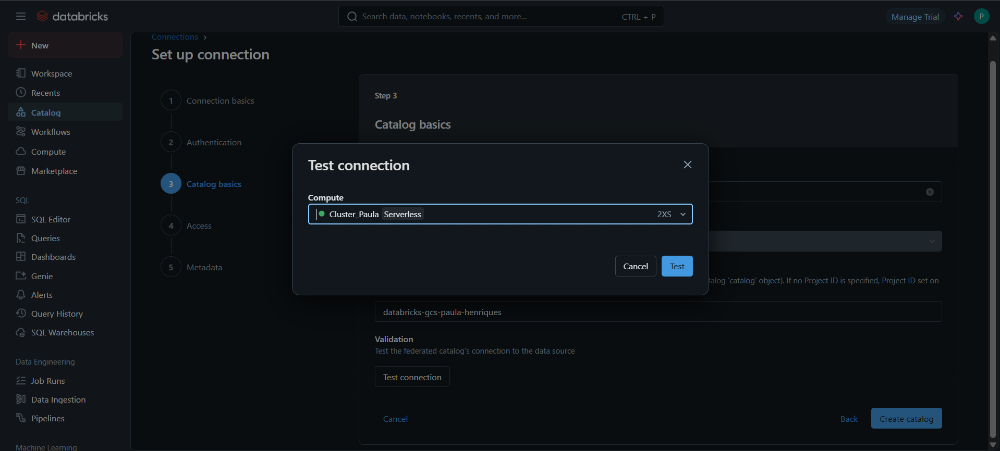
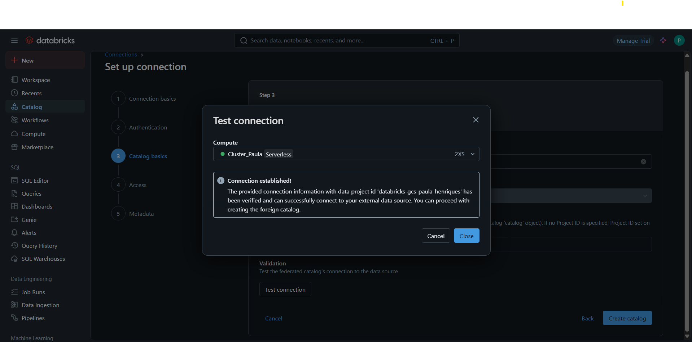
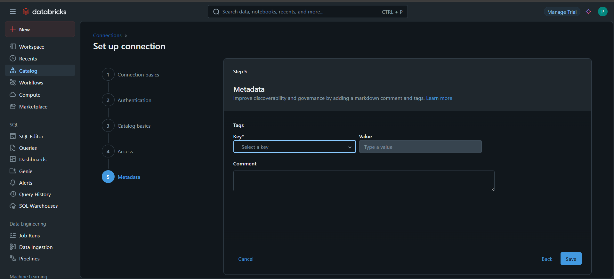

# Federation Databricks + Google Cloud Storage usando Bucket e Chave JSON

## Resumo

Recentemente precisei integrar o BigQuery com o Databricks para consumir uma base de dados de forma segura e eficiente.  
Após alguns testes, optei por utilizar um bucket no Google Cloud Storage (GCS) com autenticação via chave JSON de uma conta de serviço.  
Documentei aqui todo o processo tanto como referência pessoal quanto para apoiar quem estiver passando por algo semelhante.

---

## 1 - Criando um bucket

1.1 - Acesse o [Google Cloud Console](https://console.cloud.google.com/?hl=pt-br)  
1.2 - Na barra de pesquisa, procure por "bucket", como mostro na imagem:  
  
1.3 - Ao abrir a tela de buckets, repare que a opção "+ Criar" pode estar desativada. Será necessário adicionar uma forma de pagamento:  
  
1.4 - Após inserir os dados de faturamento, a opção "+ Criar" ficará ativada:  
  
1.5 - Clique em "+ Criar", escolha um nome para o bucket e clique em "Continuar":  
  
1.6 - Nas opções de armazenamento, mantive as configurações padrão (default):  
  
1.7 - Siga com os padrões nas etapas seguintes. No final, clique em "Criar":  
  
  
1.8 - Com o bucket criado, você verá a tela com a opção de upload. Como neste caso vamos puxar dados do BigQuery, seguimos para o próximo passo:  


---

## 2 - Exportando a base do BigQuery

2.1 - Acesse a base no BigQuery. A utilizada neste exemplo está neste link: [Base dos Dados – Medicamentos Industrializados](https://basedosdados.org/dataset/bd52ab08-9980-4831-a88c-a1ac5226ef27?table=26d8e34b-731c-4852-a838-f3f6409a07f6)  
Clique nos três pontinhos e selecione "Fazer consulta" (Query):  
  
2.2 - Faça um SELECT simples para entender a estrutura da tabela:  
  
2.3 - No seu projeto, clique nos três pontinhos e selecione "Criar conjunto de dados":  
  
2.4 - Escolha um nome e clique em "Criar conjunto de dados":  
  
2.5 - Volte à query e crie uma nova tabela copiando os dados da original. Exemplo:  
[**copiar_tabela_microdados.sql**](copy_microdata_table.sql)  
  
2.6 - No canto superior direito da interface, clique no ícone de terminal (Cloud Shell). Use o seguinte comando para extrair a tabela para seu bucket:

```bash
bq extract \
  --destination_format=CSV \
  --field_delimiter="," \
  --print_header=true \
  'databricks-gcs-paula-henriques:anvisa_dados.microdados' \
  'gs://bucket_databrciks_gcs/microdados_anvisa/microdados_*.csv'
```


Após a execução, os arquivos devem aparecer conforme a imagem:  
  
2.7 - Para conferir, acesse novamente o bucket via console:  


---

## 3 - Criando a conta de serviço

3.1 - Pesquise por "IAM" no console e selecione a opção:  
  
3.2 - A tela de IAM será semelhante a esta:  
  
3.3 - No menu lateral, selecione "Contas de serviço":  
  
3.4 - Clique em "Criar conta de serviço", escolha um nome e avance:  
  
3.5 - Nas permissões, vá em "Em uso" e selecione "Proprietário":  
  
3.6 - Clique em "Continuar":  
  
3.7 - Mantenha o padrão em "Principais com acesso" e conclua:


---

## 4 - Gerando a chave de autenticação

4.1 - Com a conta criada, clique sobre ela:
  
4.2 - Vá até a aba "Chaves":
  
4.3 - Clique em "Adicionar chave" e selecione "Criar nova chave":  
  
4.4 - Escolha o formato **JSON**:
  
4.5 - O download será feito automaticamente para seu computador:  
  
4.6 - Abra o arquivo .json e copie todo o conteúdo. Iremos colar no Databricks:  


---

## 5 - Conectando ao Databricks

> ⚠️ Importante: você precisa ter permissões para criar clusters e conexões no Databricks.

5.1 - Acesse o Databricks, vá até **SQL Warehouse**, escolha o cluster desejado e ligue-o:  
  
5.2 - Vá até **Catálogo**, clique em “+” e selecione “Create a connection”:  
  
5.3 - Escolha “Google BigQuery” como tipo de conexão e clique em “Next”:  
  
5.4 - No campo de chave, cole o conteúdo do JSON gerado no passo 4.6.  
O project_id também está dentro do JSON. Após preencher, clique em “Create a connection”:  
  
5.5 - Dê um nome para o seu catálogo, insira novamente o project_id e clique em “Test connection”:  
  
5.6 - Será solicitado que selecione o cluster. Lembre-se: ele deve estar ligado. Depois, clique em “Test”:  
  
5.7 - Se a conexão for bem-sucedida, você verá uma tela como esta:  
  
5.8 - Nas etapas seguintes (“Access” e “Keys”), apenas avance clicando em “Next”:  
  
  
Pronto! Conexão feita com sucesso. 😉

---

## 6 - Validação

6.1 - Acesse o **Catálogo** no Databricks para conferir se a conexão foi criada corretamente:  
  
6.2 - Como o objetivo era garantir a carga completa da base, realizei um COUNT(*) tanto no Databricks quanto no BigQuery para comparar os totais:  
  


---

## Observações finais

Espero que este conteúdo tenha te ajudado a entender melhor o processo de integração entre o BigQuery e o Databricks via Google Cloud Storage.  
A ideia aqui foi documentar de forma prática os principais passos que enfrentei, pensando tanto como referência futura quanto para apoiar quem estiver passando por algo semelhante.

Se você tiver sugestões, dúvidas ou quiser trocar experiências sobre esse tema, fique à vontade para entrar em contato.
